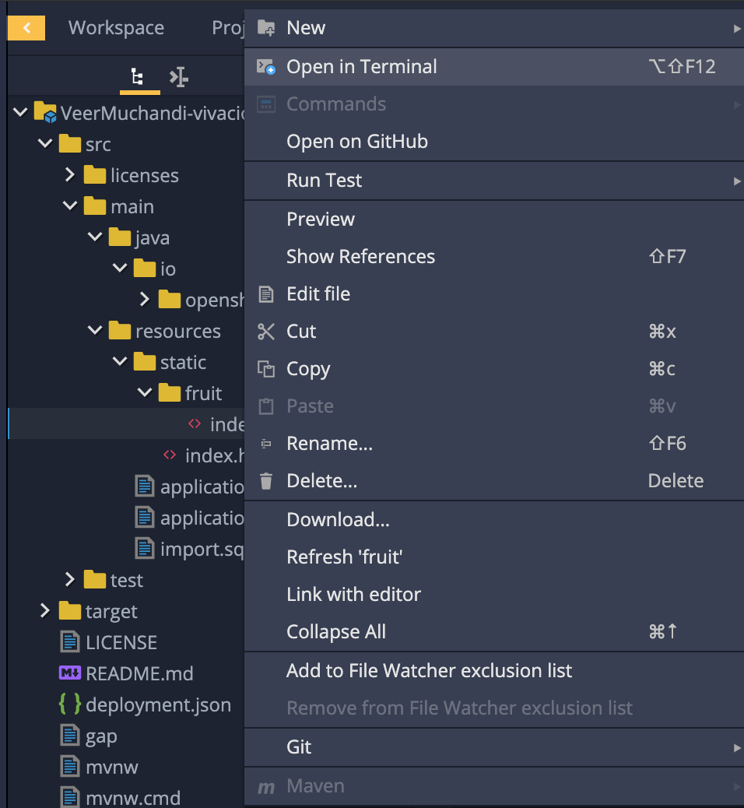
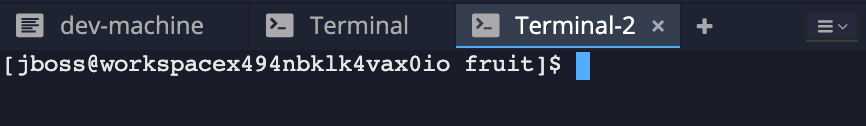
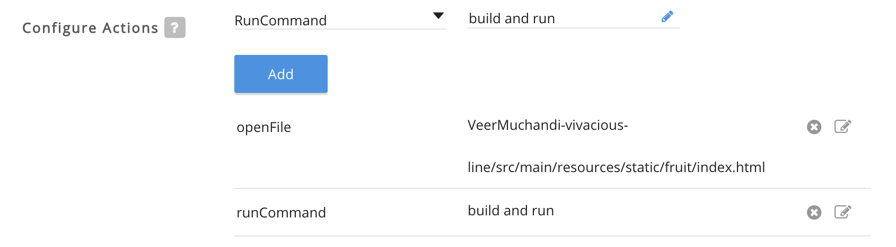
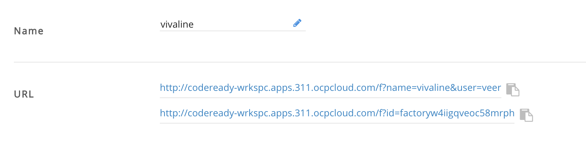

## Creating Factory

So far we created a workspace in CodeReady Workspaces with certain stack, imported code, and configured our workspace with maven configuration, added maven commands for `build and run` and `debug`, added remote debug configuration etc. This is some good amount of work and expecting every developer on the team that is working on our project/code is both time consuming and error prone. Onboarding developers has always been a challenge. 

How about a simple link that can be shared with our team members so that this configuration can be repeated? 

Welcome to **Factories** with CodeReady Workspaces. Factories take care of 'but it runs on my machine' syndrome.

We will create a factory that can 		

* replicate our workspace
* run `build and run` maven command once the workspace is created automatically
* open the file `fruit/index.html` for convenience


### Prerequisites

You have a workspace previously configured.

### Create Factory

Open your workspace if it is not already running
 
Navigate to `src->main->resources->static->fruit->index.html` file

Right click on `index.html` file and choose `Open in Terminal`



This opens a new terminal window as shown below



Run `pwd` to find the path as below.

```
[jboss@workspacex494nbklk4vax0io fruit]$ pwd/
projects/VeerMuchandi-vivacious-line/src/main/resources/static/fruit
```

Ignore `projects/` part and copy the rest. We will use this for opening the `index.html` file by default.

Now let us create a factory by clicking on menu `Workspace`->`CreateFactory`


Provide a name for the factory and press on `Create` button and then `Close` the popup window.

Now if you navigate to Factories in the CodeReady Workspaces menu on the left, you will find a new factory with the name you gave.

Click on that factory to open it. Take a few minutes to review this factory 

Now let us add a couple of commands. Scroll down to `Configure Actions` section and click on the dropdown to select `openFile`. Enter the path of your `index.html` file, in my case it is `VeerMuchandi-vivacious-line/src/main/resources/static/fruit/index.html`

Press on the `Add` button and add an additional command to run our maven command `build and run` that we added  [in this lab](EditCodeUsingCodeReadyWorkspaces.md#) by default.



Now your factory is ready. Scroll back all the way to the top, you will see two URLs to share your factory with your team. You can use either of them.



Select one of those URLs and paste it in the browser or share it with your colleage.

Note that factory url will start a new workspace with the exact same configuration. It will open the `fruit/index.html` file as well as run the `build and run` as soon as the workspace comes up.

### Summary

In this lab, we have learnt to create a factory to share your workspace settings with your team.


