## Using CodeReady Workspaces

CodeReady Workspaces is a developer workspace server based on Eclipse Che that includes a web IDE, project code and containerized runtime.

We will learn using CodeReady Workspaces to edit the code and test it locally within the workspace. Once we are happy with the code changes, we will push it to source control, which will trigger the application build and deployment to OpenShift.

### Prerequisites

* This lab assumes that you generated code using Launcher as defined [here](GenerateCodeUsingLauncher.md)
* CodeReady Workspaces is deployed on your OpenShift cluster and you have credentials to log onto this cluster. These credentials are added to the Keycloak server allowing you to login.

OR

* You are using [http://che.openshift.io](http://che.openshift.io) as your workspace environment. If using [http://che.openshift.io](http://che.openshift.io), you should register with openshift.io

### Create a Workspace

Launch your workspaces environment and login with your credentials. You will land up on the CodeReady Workspaces Dashboard. Dashboard allows you to

* Create new Workspaces

* Manage Stacks that are recipes for developer environments which include the base OS, all the runtime components needed by a project, the developer tooling needed, and the source code for the project (including optional branch and commit ID specifics). 

* Manage Factories that allows sharing workspaces to make onboarding developers easy. Any authorized person on your team can open the factory’s URL and get a new copy of that workspace. When the new workspace is created, you can have the factory clone a repo, open some files, build them, start a server in the workspace, and deploy code to that local server

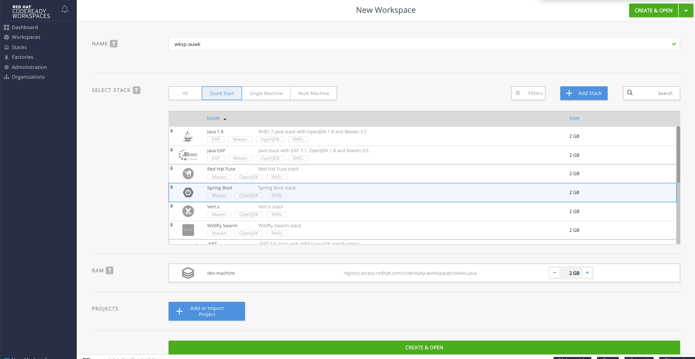

Let us create a new Workspace.

* **Name:** Either enter a name for your workspace or choose the generated name
* **Select Stack:** Since we are building off existing SpringBoot code, select SpringBoot stack.
* **RAM:** You can choose the RAM size for the dev-machine. We can leave the default `2GB`
* **Projects:** Click on `Add or Import Project`. Choose `Git` option and paste the URL for the GitRepo where your code was created by the Launcher.
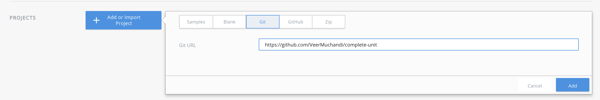
* Create on the `Create and Open` button. This will start launching a new workspace.

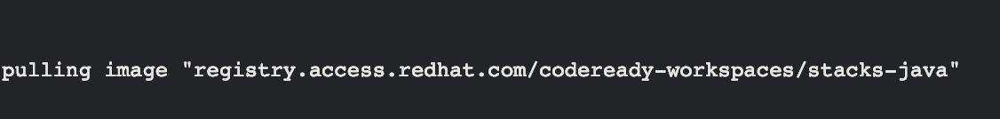

Workspace launch will take a few mins as it has to download the container image, create a new workspace pod, download project code and dependencies, and bring up the IDE within the workspace. If you have access to the workspace project in the OpenShift cluster, you can also watch the coming up of the new workspace pod. Once the workspace is up, you will see the editor as shown below. Familiarize yourself with the interface and the menu options. Also note that the code is cloned from GitRepo and is available in the editor. 

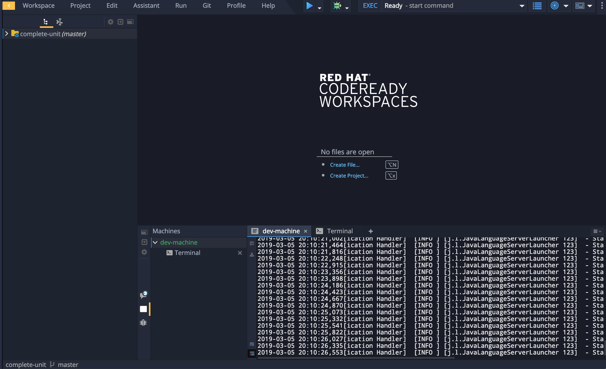

Understand the code. The CRUD application is in `io.openshift.booster.database` package. The APIs are called from `index.html` in `resources`->`static`->`fruit`.


**Note:** For convenience, you can double click on any window's title to make it display in full screen.
Also you can switch the views or get back to the default view by clicking on the following view changer button on the right top of the screen.
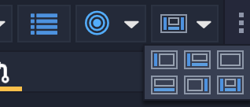


### Workspace Overview

Click on the dashboard in the menu on the left. You will see a running workspace in the dashboard now. This is the workspace management view. You can stop, start or delete the workspace here. 

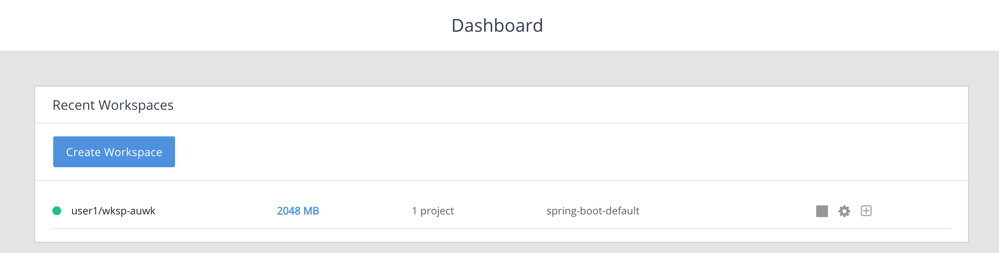

Double click on the workspace to look at the properties.

	

Navigate through the menu items to understand the configuration of the workspace. Of special interest here is `springboot` key on the `Servers` tab as we will be using this variable to set up the `Preview URL` to the application running in the workspace. Note that this is pointing to the route exposed by the workspace on port 8080. You can verify this route on your OpenShift cluster in the project where the workspace is running. 

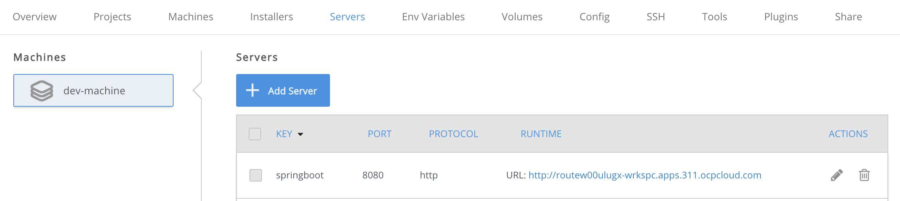

Also note the workspace configuration json, in the `Config` tab, Plugins and other tabs for information of interest.


### Set up code to use a local h2 database

#### Edit POM file
 
Expand the project tree by clicking on the project root and navigate through the project structure. Open `pom.xml` file. Note that the dependency for postgresql database was already set up in the code by the launcher that generated this code.

* Identify `<profiles>` section towards the end of this file
* Add a new profile named `local` as shown below. This profile uses a h2 database as a dependency. 

```
	 <profile>
    <!-- VEER: Added local Profile -->
      <id>local</id>
      <activation>
        <activeByDefault>true</activeByDefault>
      </activation>
      <dependencies>
        <dependency>
            <groupId>com.h2database</groupId>
            <artifactId>h2</artifactId>
            <scope>runtime</scope>
        </dependency>
      </dependencies>
    </profile>
```
When launched with local profile, the application will now be able to use h2 database instead of the Postgresql database.

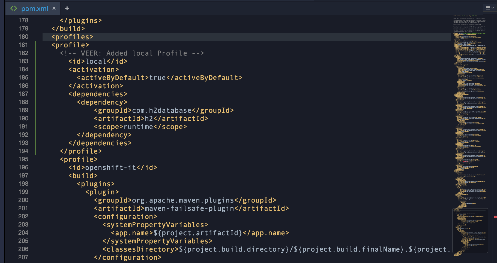

#### Add application-local.properties file

Navigate to `src`->`main`->`resources` in the Project menu on the left. You will  find `application.properties` file. The properties in this file refer to connection information and driver for postgresql database as below:

```
spring.datasource.username=${DB_USERNAME}
spring.datasource.password=${DB_PASSWORD}
spring.datasource.url=jdbc:postgresql://${DB_HOST}:5432/my_data
spring.datasource.driver-class-name=org.postgresql.Driver
spring.jpa.hibernate.ddl-auto=create
```

In order to connect to h2 database, we need these parameters for h2 database. Let us create a `application-local.properties` file in the same folder. Right click on `resources` and choose `New`->`File`. This will display a `New File` dialog. Enter the name as `application-local.properties` and add the following parameters in this file to use h2 driver and connections.

```
spring.datasource.username=${DB_USERNAME}
spring.datasource.password=${DB_PASSWORD}
spring.datasource.url=jdbc:h2:mem:my_data;DB_CLOSE_ON_EXIT=FALSE
spring.datasource.driver-class-name=org.h2.Driver
spring.jpa.hibernate.ddl-auto=create
```

Now our code is ready to be built and tested locally with a local h2 database.

### Set up Maven command to build and run locally

Let us now add maven command. On the top of the project explorer you will see two options. It switches between code and commands. The view you are currently in is shown with a yellow line under.

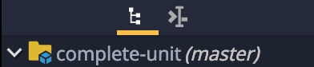

Let us switch to command view. 

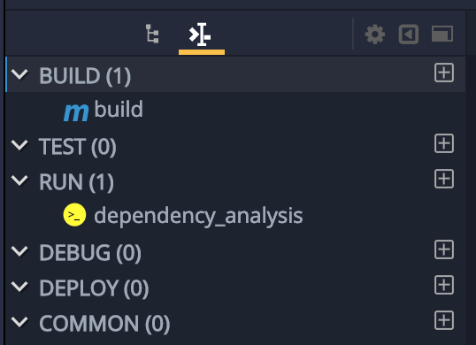

* Click on the `+` sign next to Build and choose `Maven` type, to add a new `build and run` command.

* Replace the command with the following:
	*  We are allocating some extra memory `500m` for the build in the workspace as the default `100m` is insufficient.
	*  Using `spring-boot:run` with `local` profile we created earlier
	*  Passing `local` as run.profiles so that runtime picks up `application-local.properties` 

```
MAVEN_OPTS='-Xmx500m' && mvn clean spring-boot:run -Plocal -Drun.profiles=local -f ${current.project.path}/pom.xml
```

* Set the preview URL to `${server.springboot}/fruit/index.html`. As noted earlier while looking at the workspace configuration, `server.springboot` points to the route exposed on port 8080 for your application pod. 

* Save the command by clicking the `Save` button

### Build and Run code in the workspace

You can do this a couple of ways. 

* Click on `Run` button in the `build and run` command in the command view you were edited in the last step
* Click on the command palette button  <!-- .element height="50%" width="50%" --> and choose the `build and run` command to run

* You will quickly see that a new terminal windows comes up showing the build in progress. The maven dependencies will be downloaded and the build runs. This ma take a few minutes to complete. 

* Also note that the `command` and `preview url` are displayed on the top of this window. 

* Watch the logs as the build completes and you will see that it applies `local` profile as the application comes up `io.openshift.booster.BoosterApplication  : The following profiles are active: local`

* Also note as it connects to the H2 Database `org.hibernate.dialect.Dialect            : HHH000400: Using dialect: org.hibernate.dialect.H2Dialect`

* Wait until the application starts up and you see this kind of a message `io.openshift.booster.BoosterApplication  : Started BoosterApplication in 38.545 seconds (JVM running for 40.142)`

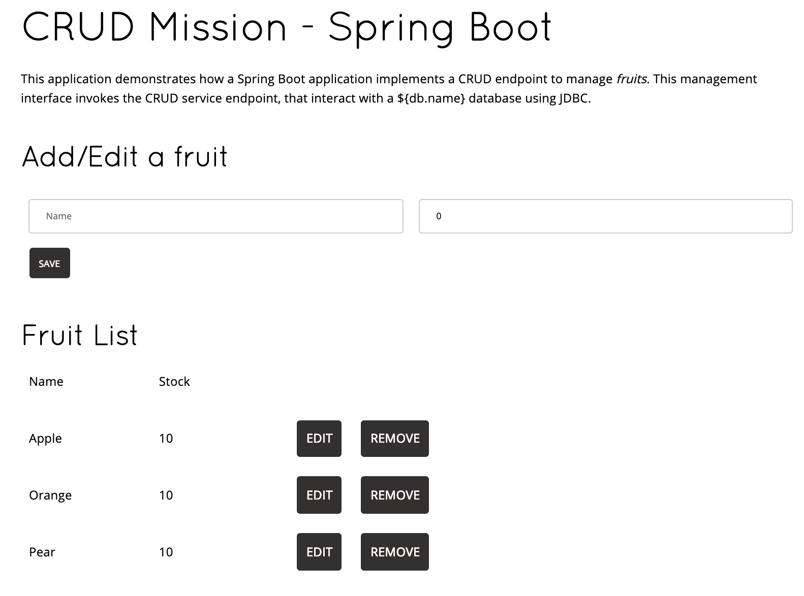


* Click on the preview URL now to launch the application in the browser

* Test the application now by adding, editing and removing some fruits and their quantities

 
### Editing Code

* Let us now make some code changes. Navigate to `resources`->`static`->`fruit` and open the `index.html` to edit.

* Let us change the header  `<h1>CRUD Mission - Spring Boot</h1>` to `<h1>CodeReady Spring Boot Example</h1>` or anything of your choice

**Note:** Changes are auto-saved.

* Close the previous `build and run` window.

* Run `build and run` again. Wait until the application starts running

* Test the application again to notice the changed code deployed

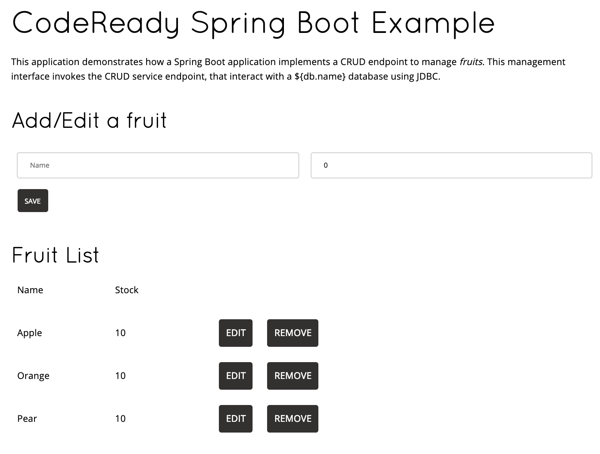

Now that we have changed the code and happy with the code changes, it is time to commit the changes to the git repo and thereby deploy it to the OpenShift cluster.

### Git Repository Setup

When the workspace is created CodeReady configures Git Repo for HTTPS access which requires user credentials. CodeReady doesn't prompt for credentials when we try to push the changes. We need to configure this repo to use ssh access instead.  

* Open Git Menu and navigate to `Remotes`-> `Remotes`. 
 
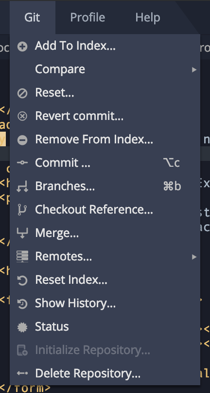

* You will find your git repo configured as `origin`. Select and `Remove` the same

* Go to your git repo and find the SSH link for your repo. 
 
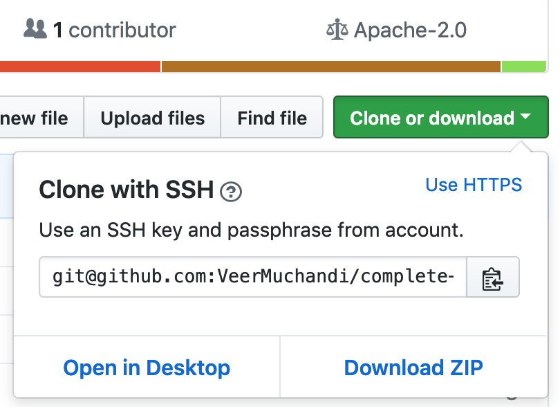

* Add this as a remote repository as `origin`

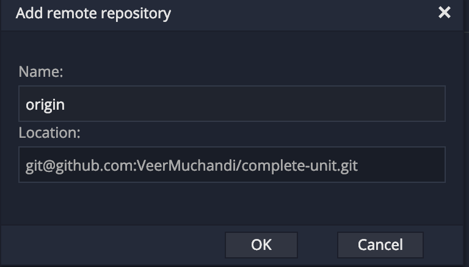


We also need to add the SSH Key to the user preferences to be able to push the code using SSH.

* Navigate to menu `Profile`->`Preferences`->`SSH`->`VCS`. You can either upload the SSH key here or generate key and [add it to your git repository](https://help.github.com/en/articles/adding-a-new-ssh-key-to-your-github-account) to be able to push code changes using SSH.

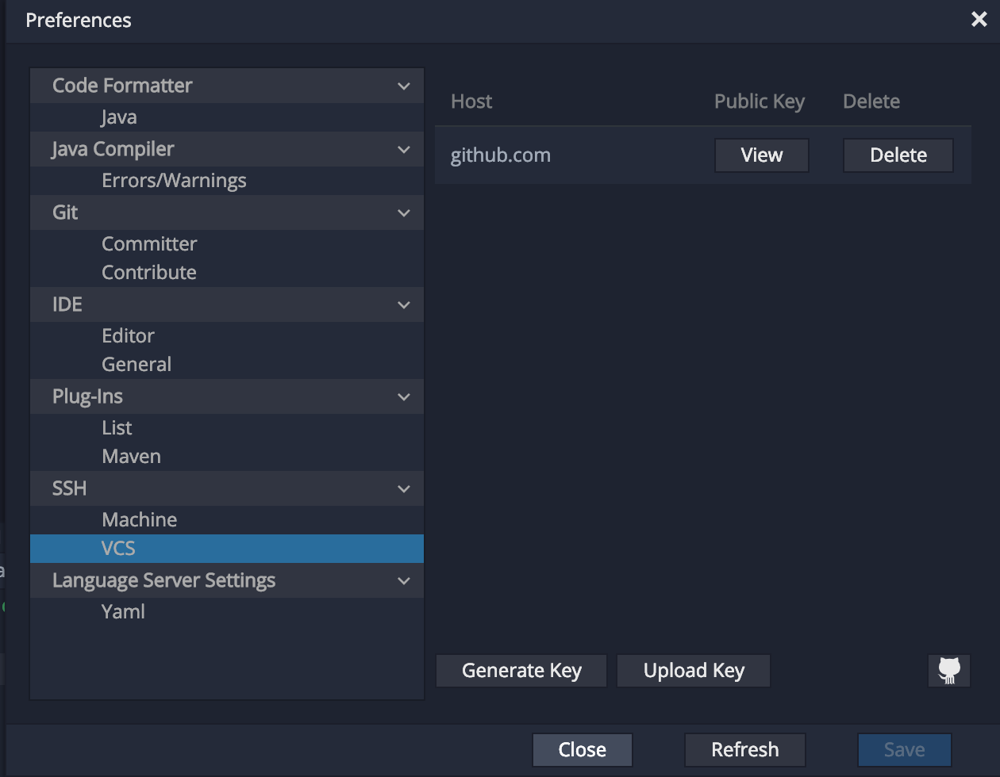


* Also update the Git committer details by navigating to 

`Profile`->`Preferences`->`Git`->`Committer`

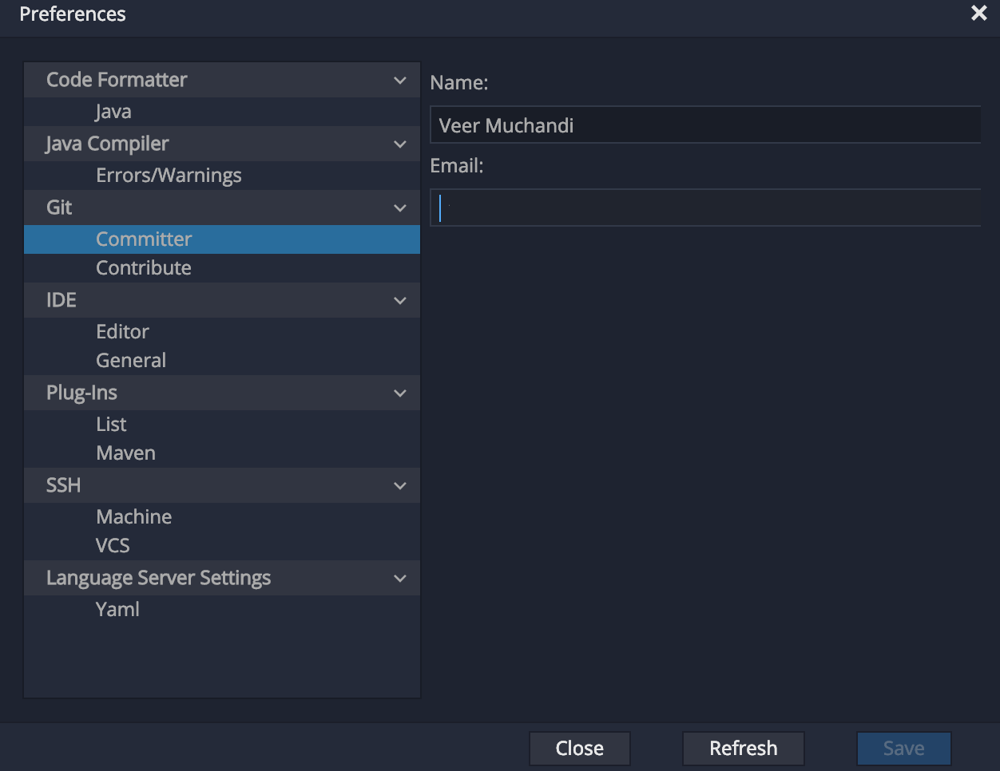

Add email and `Save`.

### Commit and Push Code Changes

#### Commit changes

Navigate to menu options `Git`-> `Commit`
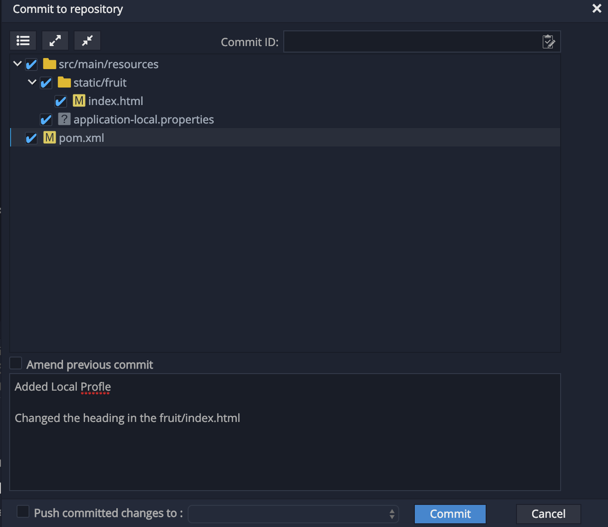

Select all the files you want to commit, add comments and press on `Commit` button to commit the changes. The changes will now be committed locally.

#### Push changes

Navigate to menu options `Git`-> `Remotes`->`Push`


and click on `Push`. This will push changes to the remote repository.


### Observe changes on the OpenShift Cluster

Navigate to the OpenShift project that was created by Launcher earlier. You will notice that a new build starts as soon as the changes are pushed, webhook configured on the Git Repo triggers a new build on the OpenShift project.

Once the build is complete, the changes are automatically deployed. Test the application again to verify that the changes are now seen on the openshift cluster.


### Summary

In this lab, we learnt to

* Create a workspace from the code in the Git Repo
* Using Web IDE in the workspace to edit the code
* Build and Test the code locally
* Configuring the workspace to access remote Git Repo using SSH
* Push the code changes to remote repo
* Observe the changes deployed to the Openshift cluster


