## Using Launcher

We will use Launcher to generate code for our microservice. 


### Prerequisites

* You either have OpenShift Online Pro account or an OpenShift cluster of your own. The Launcher can be used in [http://developers.redhat.com/launch](http://developers.redhat.com/launch) by signing in with Red Hat Developers Account with OpenShift Online Pro and GitHub Accounts.

* If using your own OpenShift cluster, you have deployed Launcher as discussed [here](./InstallLauncherOnOpenShift.md	). Your credentials are configured with the Keycloak server and Git Repo has been configured to work with the Launcher via Keycloak.


### Invoke Launcher 

First invoke Launcher in the browser. 


Choose `Launch Your Project` button.

### Choose Target Environment
 

Launcher provides two options for the generated codebase: 

* Build and Deploy to OpenShift Cluster	
* Build and Run Locally	

The first option automatically deploys code onto an OpenShift cluster. The second option allows you to download the code as ZIP file, build and deploy it yourself.

For this example let us choose to Build and Deploy to OpenShift. 

If you are using Launcher for the first time, you will have to login to the OpenShift cluster by clicking on the `Authorize` button

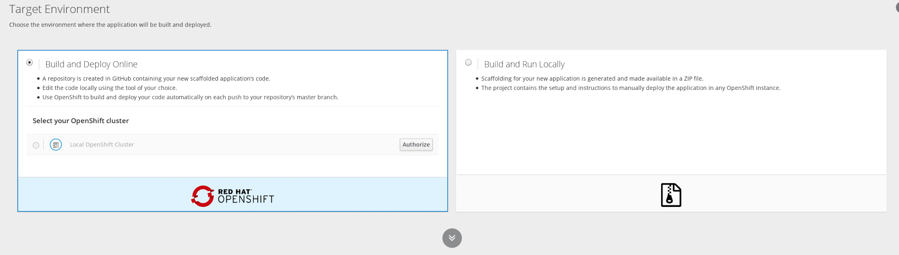

You'll see the OpenShift login screen where you can enter your OpenShift Credentials to login to the cluster. 

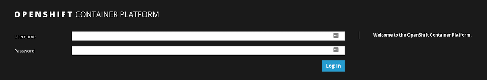

Click on `Allow selected permissions` button to allow keycloak-client to access your account.

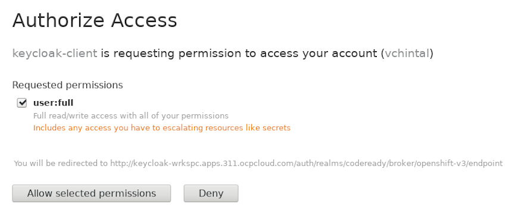

Now the control will be back to the launcher with target environment set to your OpenShift cluster. The above steps are not needed the next time you use the launcher. Now select `Build and Deploy Online` option and continue.


### Create New or Deploy Example

Now we can choose between creating a new greenfield application or deploy an example application (formerly known as booster). For this lab, we will choose to `Create a new Application`

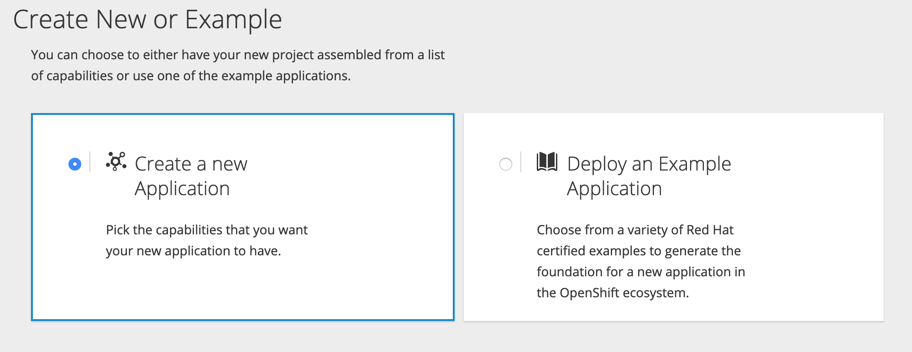


### Choose Frontend

Launcher provides option for both front-end and backend. It provides several frontend options. 

For this example, we will go with no frontend.

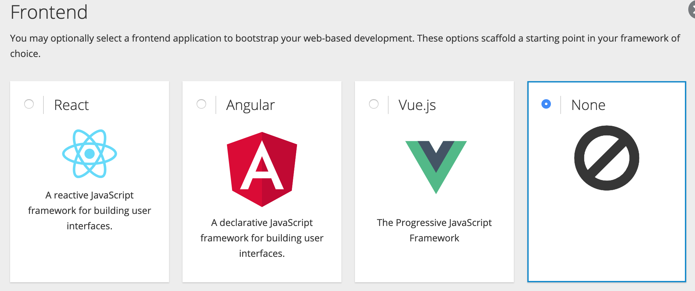

### Choose Backend

For backend, Launcher provides Node.js, Spring Boot, Thorntail and Vert.x technologies to choose from. 

For this example, we will choose Spring Boot

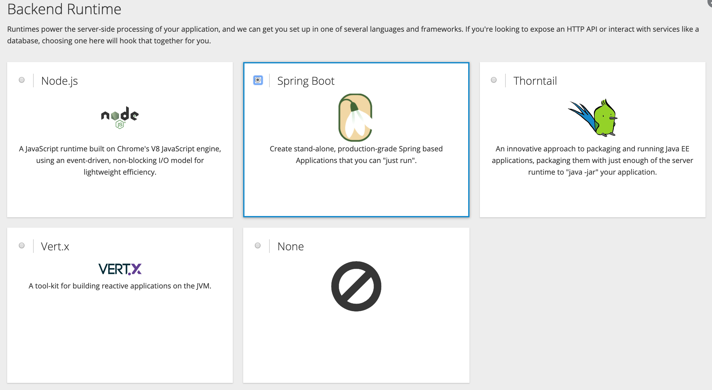

### Choose Capabilities

Launcher offers you to choose between capabilities of your application. This area will expand as more capabilities are added to the Launcher. Currently you can choose between HTTP API and Relational Persistence.

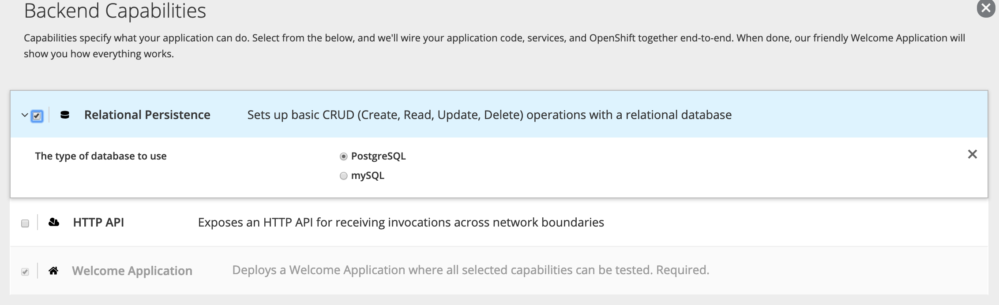

Capabilities Over Components is a theme we embrace.  This means that we don’t burden the user with setting up and integrating the disparate pieces which together provide the feature of persistence, HTTP endpoints, and the like.

For this example, let us choose `Relational Persistence`

### Choose Git Repository Details

You can now name the repository that will be created on Git Repo. But first you will have to Login to your Git account. Click on `Login & Authorize Account`

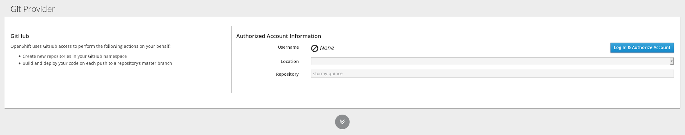

Based on the OAuth client configured in Git, it will prompt you to log into your git repository. Enter your credentials to sign into your git repo.

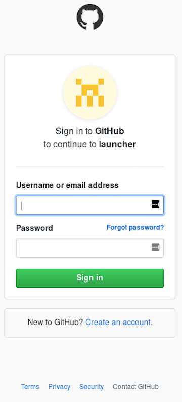

Once logged into the Git repo, authorize the launcher to access your git repository to add code.

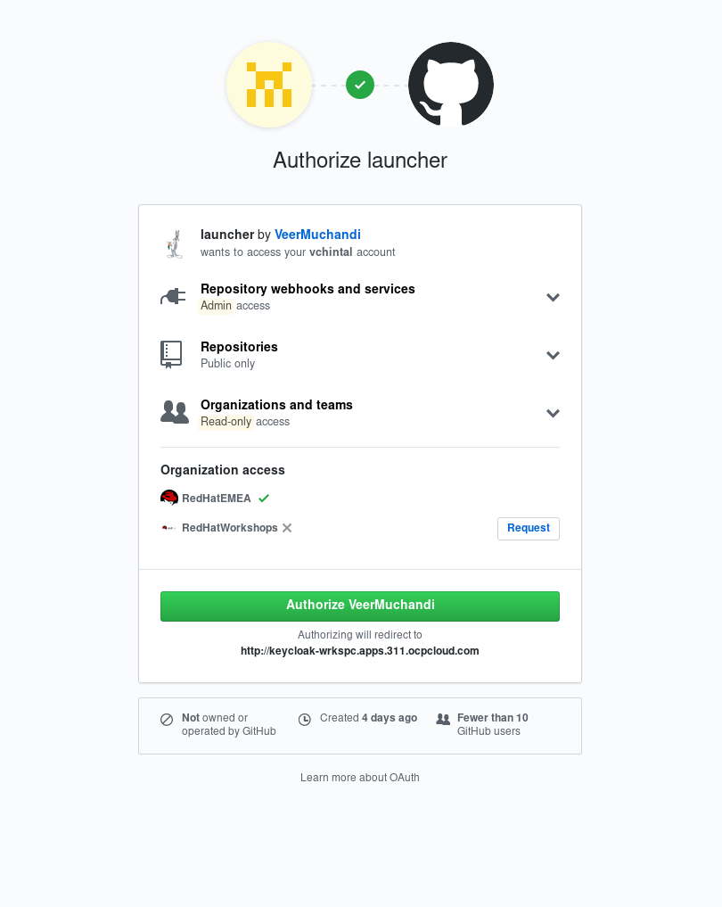

The above steps are to be performed only the first time. Once done, from next time Launcher remembers your git info and takes you directly to the next screen.

A repository name is randomly created for you. But you change it to what you want to call the repo.

**Note** If you are accessing your 

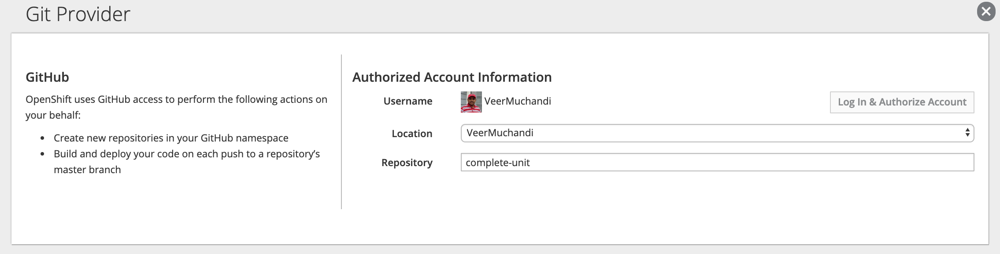

### Application Summary

Launcher now displays a summary of the project to be created. You can edit the application information such as app name, maven artifact, group id etc.

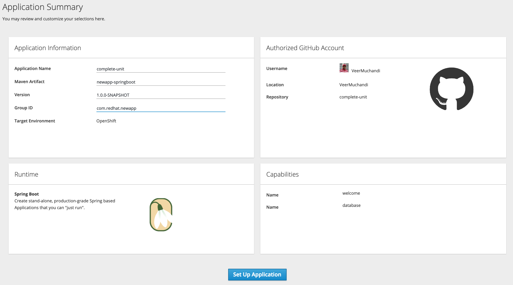

Once you are happy, click on `Set Up Application` button

### Application setup

The launcher performs a few steps:

* Generates code base
* Pushes the code to the Git repo
* Deploys the application to OpenShift. This will be multi-tiered application with a Spring Boot component and a PostgreSQL database component.
* Sets up webhooks on the Git respository so that any committed changes will trigger a new build
 
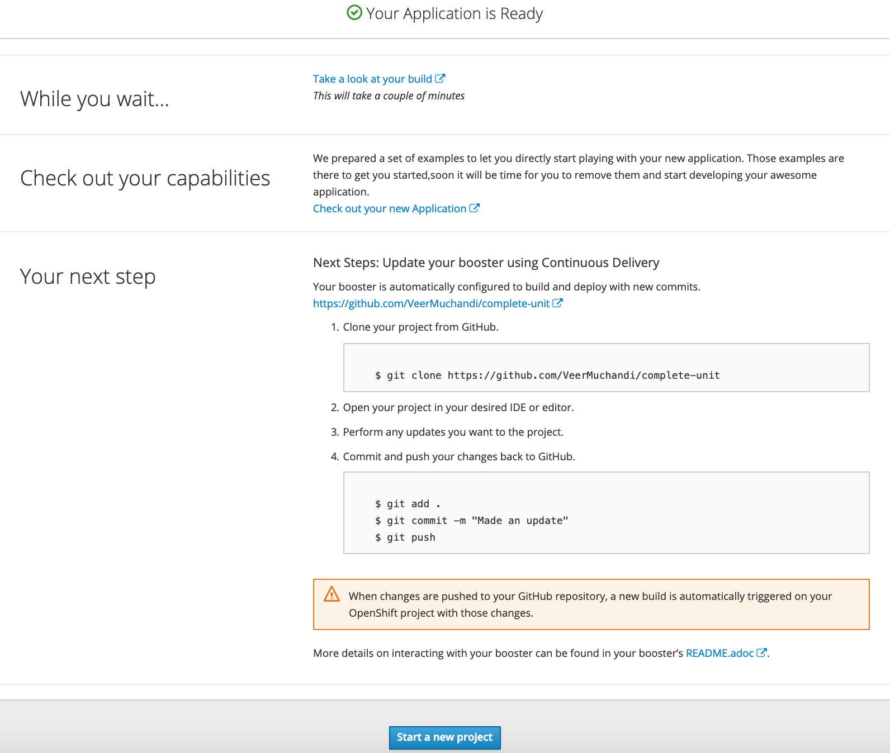


### Watch OpenShift Project 

Click on the `Take a look at your build` link to notice the OpenShift project created with the name matching the repository name. The generated code will be built and eventually deployed. You can look at the build logs too.

You'll notice an application pod and a database pod deployed. 

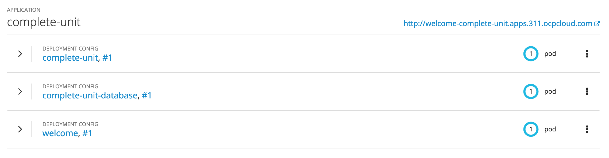

You'll also notice a Welcome application, that provides you a summary of your deployed application code. 

### Test the Code

* Once the application comes up in the OpenShift cluster test the application. In order to test the CRUD application, append the application's route with `fruit/index.html` and you will see a screen that looks like below


* Get to the terminal of Postgresql pod . You can do this either using openshift web console or by sshing to the pod. Once you are inside the terminal connect to the database using `psql` command from CLI as below

```
$ psql -h 127.0.0.1 -U $POSTGRESQL_USER -q -d $POSTGRESQL_DATABASE
my_data=> \d
             List of relations
 Schema |     Name     |   Type   | Owner
--------+--------------+----------+--------
 public | fruit        | table    | dbuser
 public | fruit_id_seq | sequence | dbuser
(2 rows)
my_data=> select * from fruit;
 id |  name  | stock
----+--------+-------
  1 | Apple  |    10
  2 | Orange |    10
  3 | Pear   |    10
(3 rows) 

```

* Now try adding, editing and removing a fruit. While you do this note the changes to the fruit table by querying it again.

### Summary

We have used Launcher to generate and deploy code on an OpenShift cluster. Launcher also made the code available on Git Repository to edit and commit. Launcher has set up webhooks to trigger a new build when code changes are committed. We have also tested the application and noted that using this application also updates the backend database.
