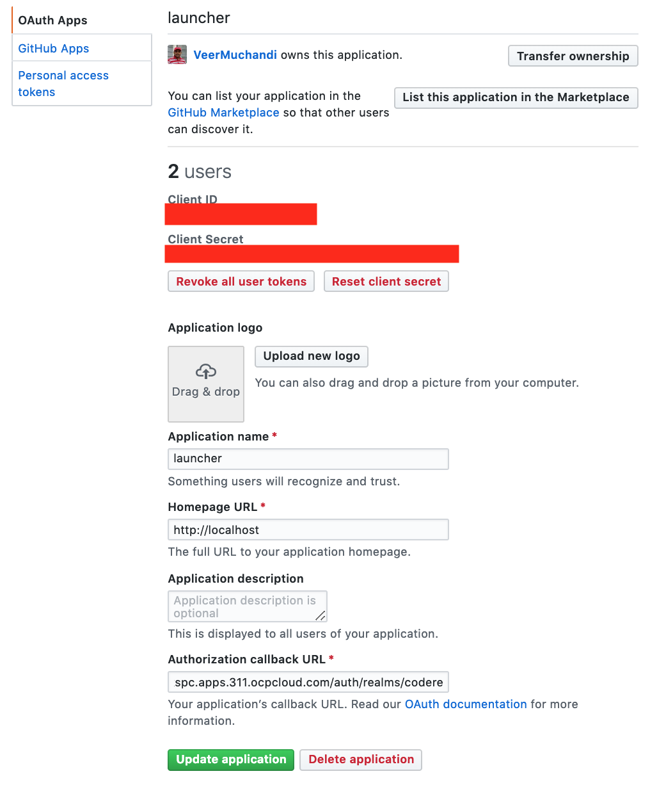
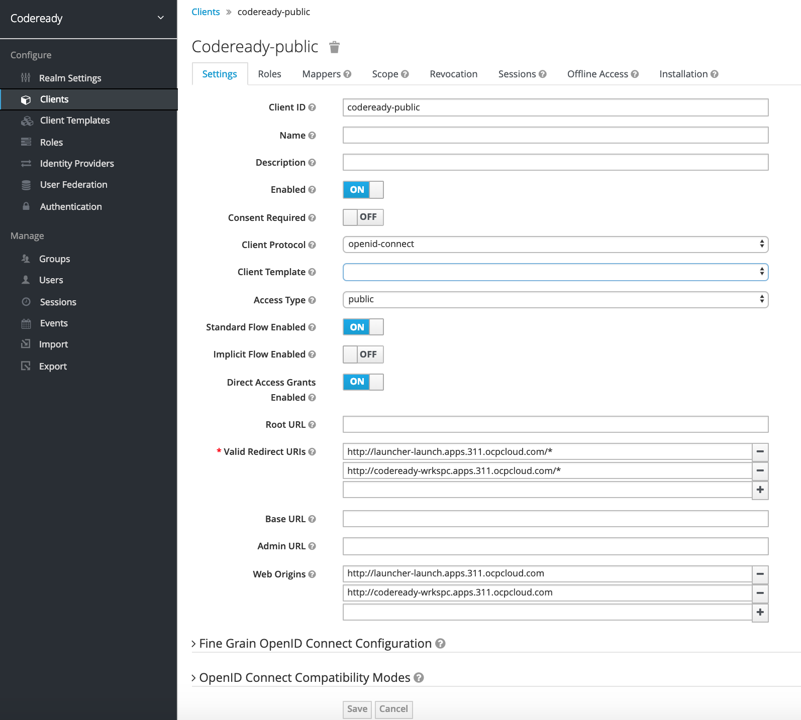
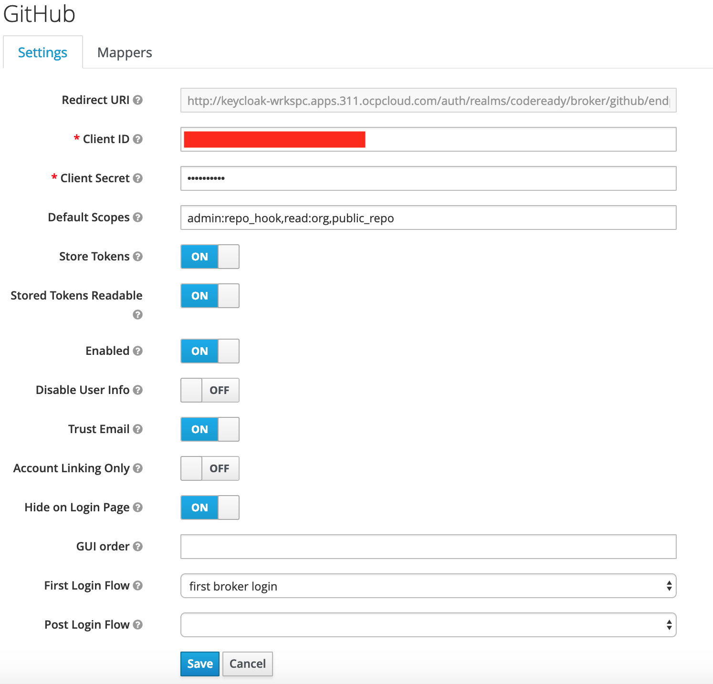
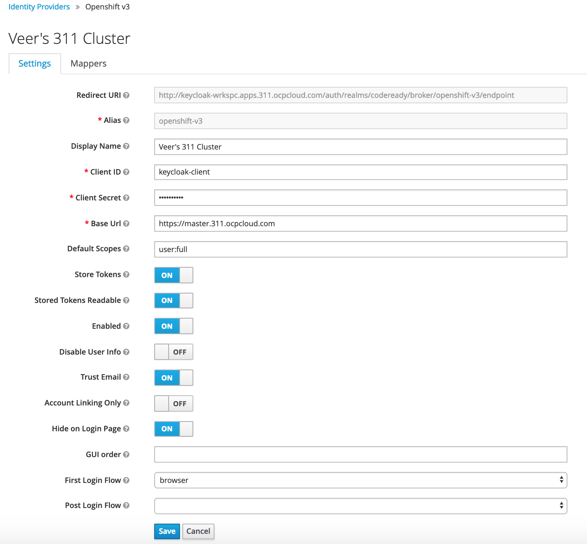
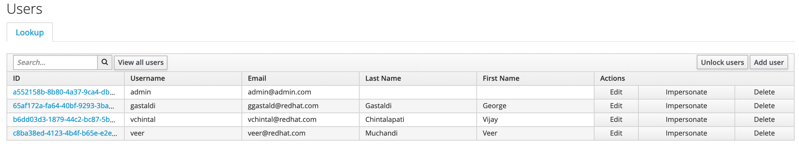
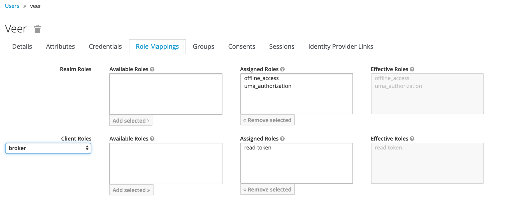
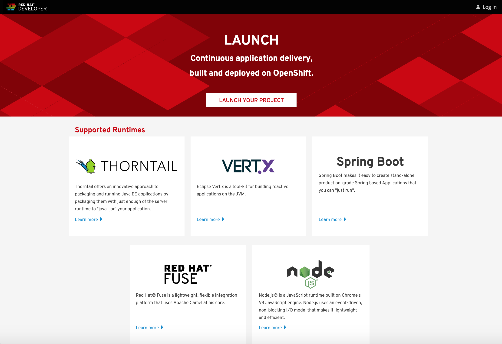

## Install Launcher on OpenShift

In this lab, we will be deploying Launcher in single user mode. Eventually an Operator is being created to install launcher in multi-user mode. 

### Prerequisites

* A running OpenShift Cluster and cluster admin access
* A workstation with `oc` CLI
* You have already installed CodeReady Workspaces on your cluster as explained [here](./InstallingCodeReadyWorkspacesOnOpenShift.md)

<!--
### Setup GitHub tokens

Follow the instructions here to add a GitHub Personal Access token
Add a token here [https://github.com/settings/tokens](https://github.com/settings/tokens) 

Instructions: [https://launcher.fabric8.io/docs/minishift-installation.html#creating-a-github-personal-access-token_minishift](https://launcher.fabric8.io/docs/minishift-installation.html#creating-a-github-personal-access-token_minishift) 

### Setup GitHub credentials

Set up GitHub credentils on the workstation from where you are installing

```
git config --global github.user $yourGitHubUsername
git config --global github.token $yourGitHubPersonalAccessToken
```
-->

### Note KeyCloak Configurations

Note the name of the Realm from `Realm Settings`. This is `codeready`.


Shift over to the `Clients` in the left menu and view the list of clients. We are specifically interested in the client with ClientId `codeready-public`


### Log on to OpenShift

Use `oc login` to log onto your OpenShift cluster

### Install Launcher

Run the following script to install the Launcher. This script will create a project named "Launch" and install launcher based on a template.

**Note :** In the future, this will be replaced by an operator.

```
curl -s https://raw.githubusercontent.com/VeerMuchandi/CodeReadyWorkspacesAndLauncherTutorial/master/launcherInstall.sh | bash
```
and watch for the output as shown below

```
$ curl -s https://raw.githubusercontent.com/VeerMuchandi/CodeReadyWorkspacesAndLauncherTutorial/master/launcherInstall.sh | bash
This script will install the Launcher on OpenShift cluster. Make sure that:

- You have run oc login previously

Press ENTER to continue ...
Creating launch project ...
Already on project "launch" on server "https://master.311.ocpcloud.com:443".

You can add applications to this project with the 'new-app' command. For example, try:

    oc new-app centos/ruby-22-centos7~https://github.com/openshift/ruby-ex.git

to build a new example application in Ruby.
Processing the template and installing ...
configmap "launcher" created
configmap "launcher-clusters" created
deploymentconfig.apps.openshift.io "launcher-backend" created
service "launcher-backend" created
deploymentconfig.apps.openshift.io "launcher-creator-backend" created
service "launcher-creator-backend" created
deploymentconfig.apps.openshift.io "launcher-frontend" created
service "launcher-frontend" created
serviceaccount "configmapcontroller" created
rolebinding.authorization.openshift.io "configmapcontroller" created
deploymentconfig.apps.openshift.io "configmapcontroller" created
route.route.openshift.io "launcher" created
secret "launcher" created
Enabling Launcher Creator
deploymentconfig "launcher-frontend" updated
configmap "launcher" replaced
All set! Enjoy!

```

Wait for a few mins for all the pods to come up.

```
$ oc get po
NAME                               READY     STATUS    RESTARTS   AGE
configmapcontroller-1-fkk5g        1/1       Running   0          1m
launcher-backend-2-deploy          1/1       Running   0          1m
launcher-backend-2-h4w42           0/1       Running   0          55s
launcher-creator-backend-2-z4tqk   1/1       Running   0          53s
launcher-frontend-3-xnjrd          1/1       Running   0          39s

```

Check the route for the launcher

```
$ oc get route
NAME       HOST/PORT                               PATH      SERVICES            PORT      TERMINATION   WILDCARD
launcher   launcher-launch.apps.311.ocpcloud.com             launcher-frontend   <all>                   None
```


### Create GitHub OAuth to enable GitHub authorization for Launcher

We will be using GitHub as the source control for our code here.  

* Login to GitHub
* Go to `Settings` >> `Developer Settings` >> `New OAuth App`. 


* Add the following field values:

	**Application Name:** `Launcher` or a name of your choice	
**Home Page URL:** `http://localhost`	
**Authorization CallbackURL:** use `http://localhost` for now *and we will update this a little later*

* Click on `Register Application`
* Note the values of `Client ID` and `Client Secret` as they will be required in the next step to configure Keycloak 


### Configure Keycloak Server

#### Configure Redirect URIs and Web Origins on the Client

Navigate back to Keycloak server and select Clients from the left menu. Select `codeready-public` client.  

* Add all requests from Launcher URL i.e, `*` to the `Valid Redirect URIs`. As an example in the above case it is `http://launcher-launch.apps.311.ocpcloud.com/*`
* Also add Launcher URL to `Web Origins`. In the above case it is `http://launcher-launch.apps.311.ocpcloud.com`

Save the changes by clicking `Save` button at the bottom.



#### Configure GitHub Identity Provider

* Navigate to Identity Providers menu option on the left

* Click on `Add Provider` on the right and choose `github` provider

* Configure `github` provider as shown below:

	**Client Id:** Use the value noted while configuring Oauth on GitHub	
**Client Secret:** Use the value noted while configuring Oauth on GitHub	
**Default Scopes:** `admin:repo_hook,read:org,public_repo`	
**Store Tokens:** `ON`	
**Store Tokens Readable:** `ON`	
**Enabled:** `ON`	
**Trust Email:** `ON`	
**Hide on Login Page:** `ON`	
**First Login Flow:** select `first broker login`	

and Click on `Save`
 


##### Change the Authorization Callback URL on GitHub

* **Note** the value of `Redirect URI` 
* Go back to GitHub, Login if you are not already in
* `Settings` >> `Developer Settings` >> `OAuth Apps` >> `launcher` (or the name that you provided earlier)
* Update the **Authorization callback URL** to the value noted from `Redirect URI` earlier

#### Configure OpenShift Identity Provider

* Log into the OpenShift cluster as an administrator	
* Create an OAuthClient. 
	* I am calling it `keycloak-client` as shown below. 
	* Change the `secret` value to your own value 
	* set the `redirect URIs` to your Keycloak server route followed by `/auth`. As an example in my case it is `"http://keycloak-wrkspc.apps.311.ocpcloud.com/auth"` 
	* Run the command to create the OAuthClient

```
oc create -f <(echo '
kind: OAuthClient
apiVersion: v1
metadata:
 name: keycloak-client 
secret: "SUBSTITUTE_YOUR_VALUE"
redirectURIs:
 - "http://YOUR_KEYCLOAK_ROUTE/auth" 
grantMethod: prompt 
')
```

* Now navigate back to `Identity Providers` menu on KeyCloak Server
* Click on `Add Provider` on the right and choose `openshift-v3` provider

* Configure `Openshift v3` provider as shown below:

	**Client Id:** `keycloak-client` or the name of of the OAuthClient if you changed it	
**Client Secret:** Use your secret value used while creating OAuthClient on OpenShift	
**Base URL:** `Your OpenShift Master URL`
**Default Scopes:** `user:full`	
**Store Tokens:** `ON`	
**Store Tokens Readable:** `ON`	
**Enabled:** `ON`	
**Trust Email:** `ON`	
**Hide on Login Page:** `ON`	
**First Login Flow:** select `browser`	

and Click on `Save`





#### Configure User Role Mappings

You'll have to repeat this for every user that will be using Launcher. If you add new users in the future, don't forget to repeat this step

* Navigate to `Users` in the menu on the left. You will find the list of users.
* You can add new users to this realm here if there are none

**Note:** Currently CodeReady workspaces is not integrated with OpenShift Authentication. Hence Launcher also doesn't use OpenShift credentials. Launcher will use CodeReady credentials. Eventually once CodeReady workspaces is configured to use OpenShift authentication, we will use same credentials for OpenShift, CodeReady and Launcher.




* Select a user and `Edit`
* Navigate to `Role Mappings` tab
* Select `broker` from the **Client roles** drop down. Add `read-token` to **Assigned Roles** by clicking on the `Add selected >>` button 

Repeat the above steps for all the users who will be using Launcher.



### Test Launcher

* Test the route to make sure Launcher is running and you see the following screen.



* Click on `Login` on the top right corner. This will take you to **CodeReady Workspaces** login page via the Keycloak server. Login with the end user credentials.
* Now it will be back to the Launcher page with the user name displayed on the top right corner.

* At this point launcher is ready to use.


### Summary

In this lab we have learnt to	

* Install Launcher 
* Integrate Launcher with the Keycloak Server
* Integrate with Github
* Enable users in the Keycloak realm to use Launcher

