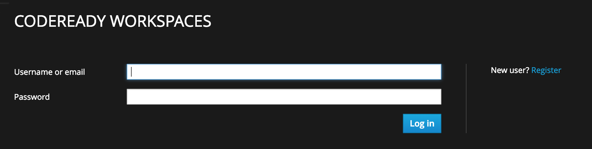
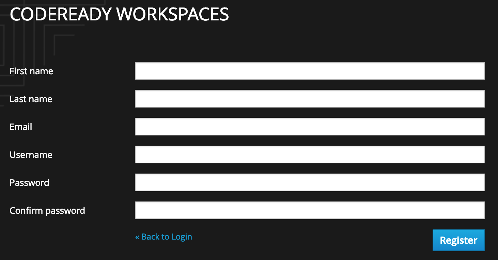
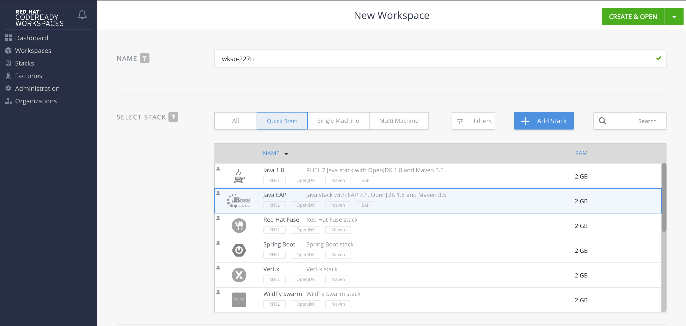
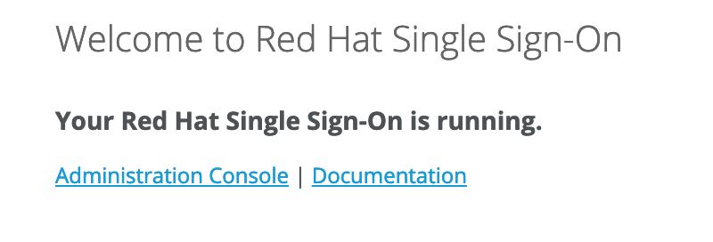
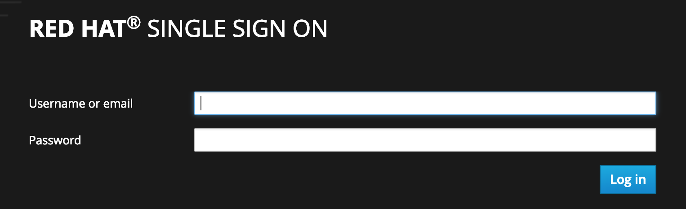
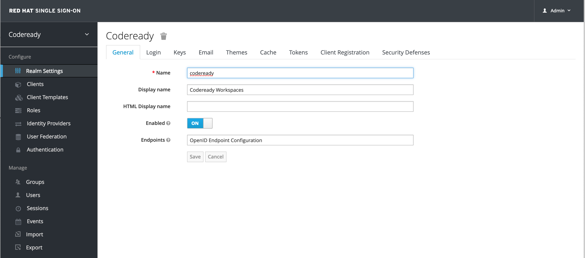
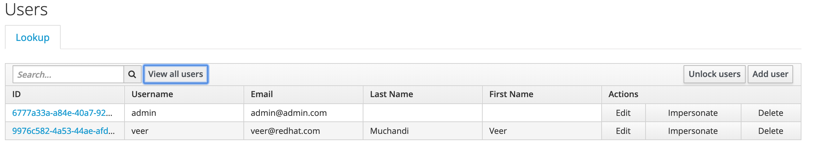

## Installing CodeReady Workspaces on OpenShift


Complete installation instructions are here. 

[https://access.redhat.com/documentation/en-us/red_hat_codeready_workspaces_for_openshift/1.0.0/html/administration_guide/installing_codeready-workspaces](https://access.redhat.com/documentation/en-us/red_hat_codeready_workspaces_for_openshift/1.0.0/html/administration_guide/installing_codeready-workspaces)

This lab provides quick step-by-step instructions for convenience. Also note that installer will change with 1.1 release.

### Prerequisites

* An OpenShift cluster to install CodeReady Workspaces. A user account to log onto te cluster. If installing with oauth enabled to use openshift authentication, you will need an account with admin privileges.
* Persistent storage on the OpenShift Cluster
* A workstation with `oc` CLI from where you want to run the installer. 

**Note :** Currently there are issues with  `enable-oauth` to allow OpenShift deal with authentication. So in this lab, we will create separate users in Keycloak and let KeyCloak deal authentiation, instead of integrating with OpenShift.


### Download Installer

Create a folder for codeready installation on your workstation from where you can log in to an OpenShift cluster

```
$ mkdir codeready
$ cd codeready
```
Download [codeready-workspaces-installer](https://developers.redhat.com/download-manager/file/codeready-workspaces-1.0.0.GA-operator-installer.tar.gz) using browser into this folder

Untar the installer files.

```

$ tar -xvf codeready-workspaces-1.0.0.GA-operator-installer.tar 
codeready-workspaces-operator-installer/
codeready-workspaces-operator-installer/README.adoc
codeready-workspaces-operator-installer/deploy.sh
codeready-workspaces-operator-installer/config.yaml

$ cd codeready-workspaces-operator-installer
```

### Install CodeReady Workspaces

Create a new project if you want name a project where CodeReady Workspaces will be installed. If not, a project named `codeready` will be created.

```
$ oc new-project wrkspc
```

CodeReady workspaces in the current setup will share a common Persistent Volume across all the workspaces. Each workspace will have its own folder on this persistent storage. Look at the documentation for other kinds of configurations such as a unique PVC for each workspace or a PVC per project.

To provide enough storage for multiple workspaces, I am setting the size of this PVC to 5Gi (change it to whatever size you wish). The default is 1Gi.

These parameters are passed via `config.yaml` file that you get along with the deploy script. 

```
$ sed -i.bak -e "s/CHE_INFRA_KUBERNETES_PVC_QUANTITY: \"\"/CHE_INFRA_KUBERNETES_PVC_QUANTITY: \"5Gi\"/" config.yaml 
```
Run the installer with the command `$ ./deploy.sh --deploy --project=wrkspc` and observe the output. The installer spins up an operator that does the installation of CodeReady Workspace Master, Keycloak server and the backend Postgresql database.

```
$ ./deploy.sh --deploy --project=wrkspc 
[INFO]: Welcome to CodeReady Workspaces Installer 
[INFO]: Found oc client in PATH 
[INFO]: Checking if you are currently logged in... 
[INFO]: Active session found. Your current context is: wrkspc/master-311-ocpcloud-com:443/admin 
[INFO]: Creating installer service account 
serviceaccount "che-operator" created
rolebinding.rbac.authorization.k8s.io "che-operator" created
configmap "che-operator" created
configmap "che-operator" patched
Unable to use a TTY - container che-operator did not allocate one
If you don't see a command prompt, try pressing enter.
time="2019-03-08T17:36:02Z" level=info msg="postgres successfully deployed" 
time="2019-03-08T17:36:02Z" level=info msg="Provisioning resources in pod postgres-97bdc58c4-lh6p5" 
time="2019-03-08T17:36:08Z" level=info msg="Provisioning completed" 
time="2019-03-08T17:36:08Z" level=info msg="Waiting for deployment keycloak. Default timeout: 420 seconds" 
time="2019-03-08T17:37:07Z" level=info msg="keycloak successfully deployed" 
time="2019-03-08T17:37:07Z" level=info msg="Provisioning resources in pod keycloak-b547b9b77-msvq6" 
time="2019-03-08T17:37:18Z" level=info msg="Provisioning completed" 
time="2019-03-08T17:37:18Z" level=info msg="Waiting for deployment codeready. Default timeout: 420 seconds" 
time="2019-03-08T17:38:13Z" level=info msg="codeready successfully deployed" 
time="2019-03-08T17:38:13Z" level=info msg="Che is available at: http://codeready-wrkspc.apps.311.ocpcloud.com" 
time="2019-03-08T17:38:13Z" level=info msg="Deployment took 2m57.32034436s" 
[INFO]: CodeReady Workspaces successfully deployed and available at http://codeready-wrkspc.apps.311.ocpcloud.com 
```

Observe the pods that come up.

```
$ oc get po -n wrkspc
NAME                       READY     STATUS      RESTARTS   AGE
che-operator               0/1       Completed   0          4m
codeready-55bb5b58-9mnwn   1/1       Running     0          2m
keycloak-b547b9b77-jvjrz   1/1       Running     0          3m
postgres-97bdc58c4-zm85h   1/1       Running     0          4m
```

Also observe the PVC created for Postgresql

```
$ oc get pvc -n wrkspc
NAME            STATUS    VOLUME                                     CAPACITY   ACCESS MODES   STORAGECLASS        AGE
postgres-data   Bound     pvc-89197bf6-41c8-11e9-8284-06c81d37223e   1Gi        RWO            glusterfs-storage   22m

```

And the routes in the project

```
$ oc get route -n wrkspc
NAME        HOST/PORT                                PATH      SERVICES   PORT      TERMINATION   WILDCARD
codeready   codeready-wrkspc.apps.311.ocpcloud.com             che-host   <all>                   None
keycloak    keycloak-wrkspc.apps.311.ocpcloud.com              keycloak   <all>                   None
```


### Self Register and Log in

Access the codeready route anc click on the `New User Register` link to self register.


Fill in the details on the next screen and click on `Register` button. 



Now you will land on CodeReady Workspaces Dashboard where you can create new workspaces as shown below:




### Keycloak User Administration

Let us now access Keycloak route and it takes you to a screen where you choose Administration Console.



Next you can log into the admin console using your administrator password. If you did not change this password in the `config.yaml` file, then it would be `admin\admin` by default. I suggest changing the password as soon as you login.



You will now see the KeyCloak dashboard.



Click on the `Users` menu on the left and `View all users` to see the list of users. You should see the self registered user there. Explore all the options you have to manage the users here.
